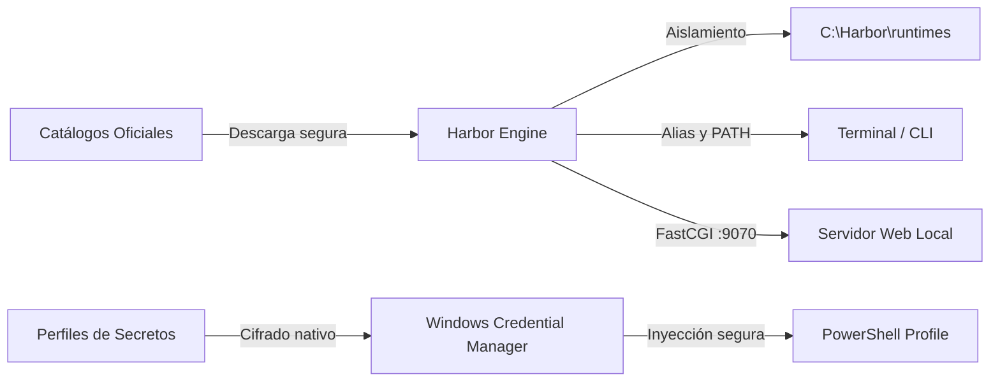

# Harbor Desktop

<p align="left">
  <strong>El centro de control nativo para entornos de desarrollo local y gestión segura de secretos en Windows.</strong>
</p>

---

## 🎯 Visión del Producto

El desarrollo local en Windows suele enfrentarse a tres problemas recurrentes:
1. **Sobrecarga de recursos**: El uso de contenedores pesados para proyectos sencillos ralentiza los equipos de desarrollo.
2. **Contaminación del sistema**: Múltiples versiones de lenguajes y servidores compitiendo en el `PATH` global de Windows provocan inconsistencias difíciles de diagnosticar.
3. **Fugas de credenciales**: Variables sensibles y claves de API almacenadas en archivos de texto plano (`.env`) sin cifrar, con alto riesgo de filtración en repositorios.

**Harbor** resuelve estos desafíos mediante una aplicación de escritorio nativa que aísla los ejecutables de desarrollo, gestiona sus ciclos de vida y almacena los secretos directamente en la bóveda de seguridad del sistema operativo.

---

## 📊 Comparativa: ¿Por qué Harbor?

| Criterio | Harbor Desktop | Docker Desktop | XAMPP / WampServer | Configuración Manual / .env |
|---|---|---|---|---|
| **Consumo de memoria / CPU** | **Mínimo** (ejecución nativa) | Alto (virtualización WSL2) | Medio (servicios permanentes) | Nulo |
| **Aislamiento de versiones** | **Aislado en `C:\Harbor`** | En contenedores | Conflictivo | Complejo / manual |
| **Seguridad de credenciales** | **Cifrado DPAPI (Windows)** | Texto plano en compose/env | Texto plano | Texto plano en disco |
| **Integración con Terminal** | **Inyección automática en PowerShell** | Requiere `docker exec` | Manual | Manual / Scripts |
| **Facilidad de uso** | **Interfaz visual moderna en 1 clic** | Curva de aprendizaje CLI | Interfaz heredada/antigua | Ninguna |

---

## 🚀 Capacidades Principales



### ⚙️ Gestión Inteligente de Runtimes y Servicios
- **Catálogos Oficiales en Tiempo Real**: Visualización de versiones actualizadas de **Node.js**, **PHP** y **Apache** directamente desde sus fuentes oficiales, con clasificación de ciclo de vida (**Active**, **LTS**, **Security**, **EOL**).
- **Instalación Aislada**: Cada versión se aloja de forma independiente sin alterar otros programas instalados en el equipo.
- **Motor PHP FastCGI**: Inicio y detención instantánea del proceso FastCGI (`127.0.0.1:9070`) para pruebas de aplicaciones web locales.
- **Activación Inmediata de CLI**: Configura automáticamente el alias ejecutable (`php`, `node`) en tu terminal sin reiniciar el sistema.

### 🔑 Bóveda Segura de Secretos y Perfiles de Entorno
- **Cifrado a Nivel de Sistema Operativo**: Los secretos nunca se guardan en archivos de configuración planos; se custodian en el **Administrador de Credenciales de Windows** (protegido por hardware/DPAPI).
- **Segmentación por Ambientes**: Crea perfiles diferenciados (`Desarrollo`, `Pruebas`, `Staging`, `Producción`).
- **Salvaguarda de Producción**: Sistema de confirmación reforzada y alertas visuales para evitar activar credenciales críticas por error en sesiones de trabajo locales.
- **Conexión Directa con PowerShell**: Al abrir una consola de PowerShell, el perfil seleccionado se carga al instante, mostrando un indicador visual con el nombre del entorno activo.
- **Limpieza y Reversión Automática**: Al cambiar de perfil o cerrarlo, Harbor restaura los valores previos del Registro de Windows (`HKCU\Environment`) sin dejar rastros residuales.

---

## 📁 Organización del Espacio de Trabajo

Harbor centraliza todos los recursos en una estructura limpia y predecible ubicada en `C:\Harbor` (personalizable mediante la variable de entorno `HARBOR_ROOT`):

```text
C:\Harbor\
├── bin/          # Wrappers y ejecutables activos expuestos en el PATH
├── runtimes/     # Binarios organizados por tecnología y versión
│   ├── nodejs/   # Versiones de Node.js (ej. 20.18.0, 22.12.0)
│   ├── php/      # Versiones de PHP (ej. 8.2.20, 8.3.14)
│   └── apache/   # Servidor web Apache HTTPD
├── www/          # Espacio raíz recomendado para tus proyectos locales
├── config/       # Metadatos del entorno y runtimes activos
└── logs/         # Registros de actividad y diagnóstico de servicios
```

---

## 💡 Flujo de Trabajo Típico

### Paso 1: Configurar un Runtime
1. Accede a la sección **Services**.
2. Selecciona el servicio deseado (por ejemplo, **PHP** o **Node.js**).
3. Elige la versión que requiere tu proyecto y pulsa **Download**.
4. Activa la versión seleccionada para sincronizar el acceso directo en la terminal o iniciar el servicio FastCGI.

### Paso 2: Administrar Variables y Credenciales
1. Ve a la sección **Secrets**.
2. Crea un perfil (ej. `Proyecto-API-Dev`) y define las variables requeridas (`DATABASE_URL`, `API_KEY`, `PORT`).
3. Haz clic en **Activate for PowerShell**.

### Paso 3: Desarrollar con tu Terminal Habitual
Abre una nueva ventana de PowerShell. Harbor cargará automáticamente las variables en la sesión:

```powershell
Harbor > Proyecto-API-Dev profile loaded
PS C:\Harbor\www\mi-proyecto> php -v
PHP 8.3.14 (cli) ...
```

---

## 🛡️ Seguridad y Privacidad

- **Zero-Telemetry**: Harbor no recopila datos de telemetría, analíticas ni información sobre tus proyectos o variables.
- **Almacenamiento Local Aislado**: Tus credenciales jamás abandonan tu equipo ni se transmiten a servidores externos.
- **Protección contra Inyecciones y Rutas Maliciosas**: Cada archivo descargado se valida contra ataques de descompresión (*Zip Slip*) antes de ser extraído.
- **Gestión No Destructiva del Registro**: Harbor registra y audita exclusivamente las claves que administra, preservando intactas las demás configuraciones del sistema.

---

## 📜 Licencia

Harbor se distribuye bajo la licencia de código abierto **MIT**.


